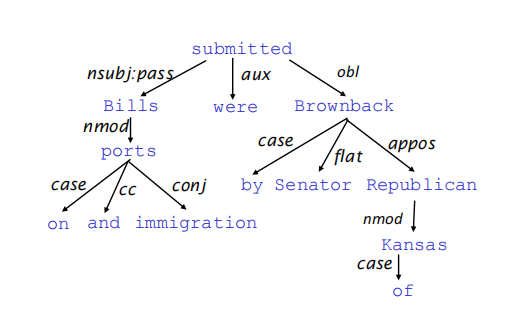
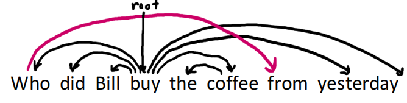

# Dependency Parsing

## Consistency and Dependency

- **syntactic structure**:  how words are arranged and related to form a grammatically well-formed sentence

  - **Consistency (Phrase structure)**: organize words into nested constituents
    - focus on phrase (NP/VP/PP)

  - **Dependency structure**: shows which words depend on which other words
    - focus on relationship between words

- human languages in syntactic terms is **globally ambiguous**.

## Dependency Grammar

- syntactic structure consists of relations between lexical items, normally **binary asymmetric relations(arrows)  called dependencies**

- **Dependency Tree:**

  

  - arrows: The arrows are commonly typedwith the name of grammatical relations
  - An arrow connects a **head** with a **dependent** 
  - Dependencies are directed**(head -> dependent)**
  - Each word depends on **exactly one head** (usually add a fake ROOT)

- **Treebank**:

  -  a linguistically annotated corpus in which sentences are paired with explicit syntactic structures, typically represented as parse tree
  - many trees + many sentences
  - Broad coverage
  - **provide a evaluation method for NLP**

- **Dependency Conditioning Preferences**:

  - **Bilexical affinities**: Certain pairs of words have a strong preference to form a dependency relation with each other. (**focus on pairs**)
  - **Dependency distance**: Most dependencies are between nearby words
  - **Intervening material**: Dependencies rarely span intervening verbs or punctuation
  - **Valency of heads**: Each head has preferences on the number and types of dependents it can take (**focus on head**)

## Dependency phrasing

- **Projectivity**: no crossing dependency arcs; all arcs above the words

  - **Syntactic hierarchy must respect the linear order of words**

  

- Some methods:
  - Dynamic programming / Graph algorithms / Constraint Satisfaction /Transition-based parsing

### Greedy transition-based parsing

- **Three parts:**
  - Stack: Store "Words in Progress"
  - Buffer：Store "unprocessed words"
  - Arc set: Established dependencies
- **Three actions**
  - SHIFT: first word in buffer -> stack
  - LEFT-ARC: Establish dependencies: stack[top-1] ← stack[top]
  - RIGHT-ARC: Establish dependencies: stack[top-1] →  stack[top]
- **Greedy:**
  - At each step, **only the highest-rated action** is selected (how to score?)

### MaltParser (Neural method)

- use a classifier to predict the each action (**not greedy algorithm**)
- Input: Stack、Buffer、POS...
- Output: Action probability distribution
- used to use **indicator feature**:
  - A discrete feature that indicates the existence of a specific event or property
  - consists of many 0/1
  - **sparse / incomplete / expensive to compute**

### Evaluation of Dependency parsing

- dependency accuracy :  **number of correct dependencies** / all dependencies