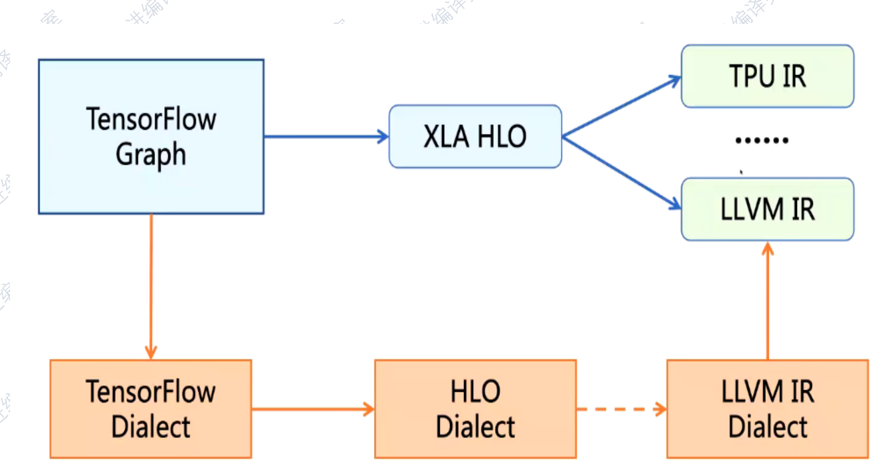
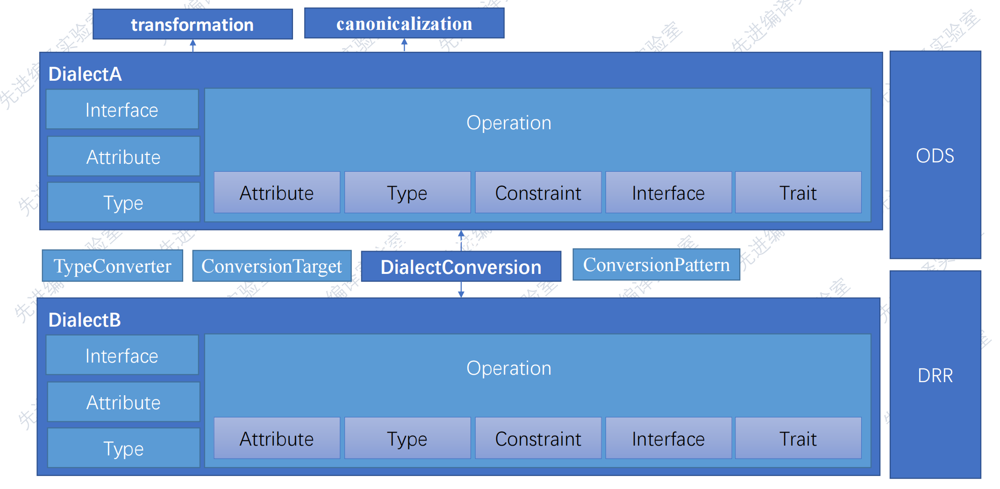
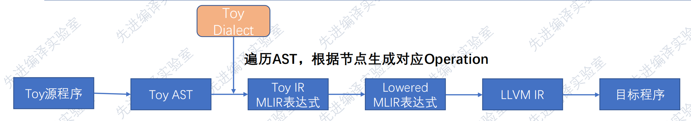
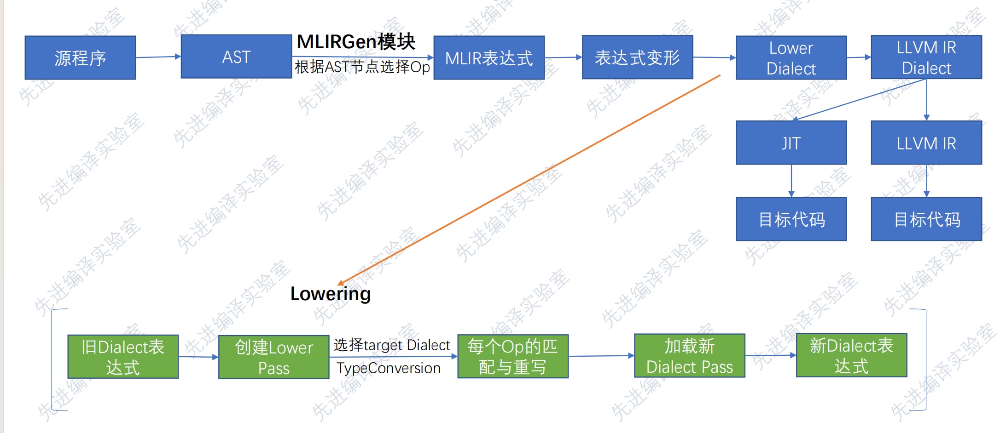
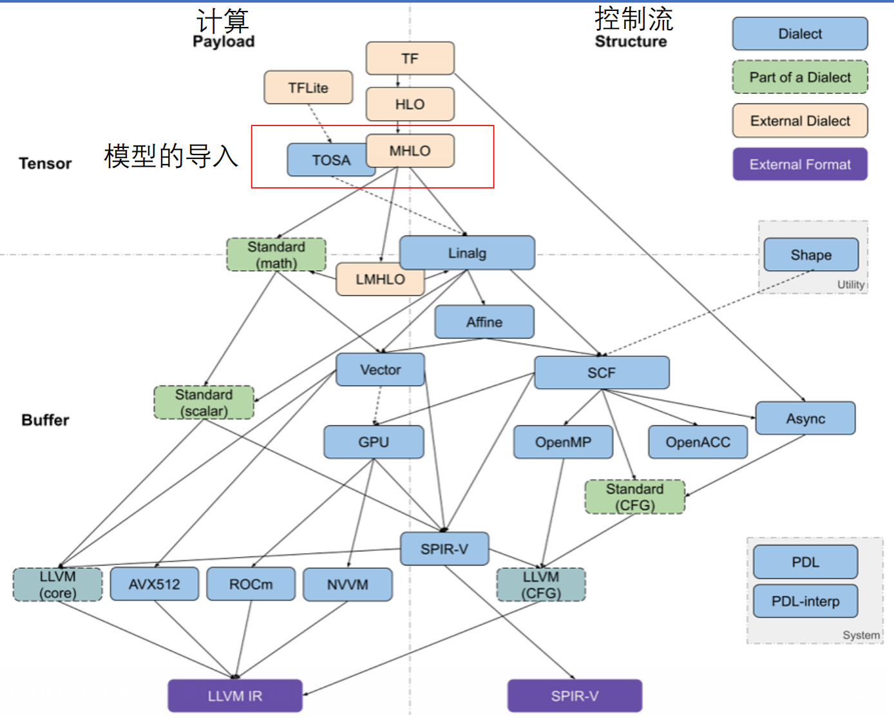

# AI Compiler

## 1. AI Compiler 核心概念

AI Compiler 是： **把“高层数学计算（张量/算子）” 逐层降低（lowering）成 “具体硬件上最高效的执行形式”**

### IR (Intermediate Representation)

不同于LLVM IR，AI Compiler IR更加关注：

- 更关注张量/算子 对象
- 关注数据流，而非LLVM IR中的控制流
- 典型优化是Fusion/Layout
- 核心原因在于**神经网络是“张量计算图”**

#### AI Compiler  IR层级

AI Compiler IR是分层的：

```
Graph IR  →  Tensor IR  →  Loop IR  →  Instruction IR
```

不同层IR具体关注点如下：

| 层级      | 关注点      | 典型 IR          |
| --------- | ----------- | ---------------- |
| Graph IR  | 算子 & 拓扑 | Relay / FX / HLO |
| Tensor IR | 张量计算    | Linalg / TIR     |
| Loop IR   | 循环结构    | Affine / SCF     |
| Low IR    | 指令        | LLVM IR          |

### 计算图（Computation Graph）

计算图基本结构：

- **节点**：算子（Conv / MatMul / ReLU）
- **边**：张量（Tensor)

```
Input → Conv → ReLU → MatMul → Output
```

需要注意这是 **静态数据流图**：

- 没有 if / while（推理时）
- 执行顺序由数据依赖决定 （有些可以并行执行）

**张量**： 带 shape 的多维数组 + 语义

- 不能将张量简单理解成数组，其还包含
- 数据
- 维度（shape）
- 数据类型（dtype）
- 语义（batch / channel / spatial）

### 算子 (Operator)

算子: 高层数学原语

- Conv2D
- MatMul
- LayerNorm

需要注意算子**更多是一个数学定义，而不是实现**；具体如何实现是**编译器的实现**

- **kernel 是编译器生成的，不是调用的**

整体分层可以如下理解：

```
模型作者：用哪些算子（Conv / MatMul / LN）
编译器前端：确认算子语义
编译器中端：决定算子如何组合 / 变形
编译器后端：决定算子如何实现
```

结合具体IR层级:

| 层级                    | 决定什么                       |
| ----------------------- | ------------------------------ |
| **Frontend / Graph IR** | 用哪些算子（Conv？GEMM？）     |
| **Middle IR**           | 算子是否 fusion、是否替换实现  |
| **Backend**             | 每个算子对应哪个 kernel / 指令 |

### Lowering

Lowering指**将“抽象高的IR” 转成“更接近硬件的IR”**

例如：

```
Conv2D
 ↓
Linalg Ops
 ↓
Nested Loops
 ↓
Vector Instructions
```

- 这个操作往往是逐层的，因为不同的优化适用于不同的层
- 硬件细节不该太早暴露

### Optimization

#### Operator Fusion（算子融合）

```
Conv → ReLU → Add
↓
ConvReLUAdd
```

目的：

- 减少内存访问
- 提升数据局部性
- 并不是简单的子函数的融合，而是**要确认中间值不会重新写内存（存在于寄存器/SRAM)**

#### Layout Transformation（数据布局）

```
NCHW ↔ NHWC
```

不同硬件偏好不同布局：

- GPU：NHWC
- CPU：NCHW
- NPU：自定义

#### Tiling / Blocking

```
for i in N:
  for j in M:
    ...
```

→ 拆成 cache / SRAM 友好的小块

#### Memory Planning

- 中间张量是否复用？
- buffer 多大？
- on-chip 还是 DRAM？

### Others

除了上面概念之外，还有如下概念，在此先不展开：

- **Schedule（调度）**：显示控制整个流程的顺序
- **Hardware Mapping（硬件映射）**
- **Auto-Tuning（自动搜索）**

## 2. 常用AI Compiler调研

### Some concepts

- 静态图：在运行前，整个计算图是已知的
  - 图结构固定
  - shape 多为固定
  - 编译一次，多次执行
- 动态图：计算图在运行时“边跑边生成”
  - Python 控制流
  - shape 可变
  - 灵活但难优化
- 自用IR: 只服务于一个特定 compiler / 公司 / 系统的 IR， 不打算被别人复用或扩展
- 通用IR: 
  - 让“不同团队 / 不同工具”共用
  - 作为长期基础设施
  - 明确语义、稳定接口

### Overview

主流图（Chatgpt提供）

```
┌───────────────┬─────────────────────────────┐
│ 框架生态       │ AI Compiler                │
├───────────────┼─────────────────────────────┤
│ PyTorch       │ TorchInductor / XLA         │
│ TensorFlow    │ XLA                         │
│ 通用 / 学术    │ TVM                        │
│ LLVM / MLIR   │ MLIR-based compilers        │
│ NVIDIA        │ TensorRT                   │
│ Intel         │ OpenVINO                   │
│ 移动端        │ MNN / TFLite / NNAPI        │
│ 新兴          │ IREE                       │
└───────────────┴─────────────────────────────┘
```

根据使用**场景分类**：

- **训练**：TorchInductor / XLA
  - 编译器的目标是加速forward + backward
  - 优化算子融合、调度
- **推理部署**：TensorRT / OpenVINO / TFLite
- **长期平台/新硬件**：MLIR/TVM
  - 长期平台指：一个会持续演进、不断接新模型 / 新硬件 / 新算子的编译平台
- 长期平台和移动端的区别：

| 对比维度   | 长期平台    | 移动端         |
| ---------- | ----------- | -------------- |
| 生命周期   | 很长        | 跟随产品       |
| 灵活性     | 高          | 低             |
| 算子扩展   | 经常        | 少             |
| 编译器定制 | 深          | 浅             |
| 技术栈     | MLIR / LLVM | TFLite / NNAPI |


根据对应的**硬件平台**（初步）：

| 硬件            | 首选                     |
| --------------- | ------------------------ |
| NVIDIA GPU      | TensorRT / TorchInductor |
| TPU             | XLA                      |
| Intel CPU / GPU | OpenVINO                 |
| 手机 SoC        | TFLite / NNAPI / MNN     |
| 自研 NPU        | MLIR / TVM               |


考虑**模型和算子特征**：

| 情况         | 更合适         |
| ------------ | -------------- |
| 标准模型     | TensorRT / XLA |
| 自定义算子多 | MLIR / TVM     |
| 算子层控制强 | MLIR           |
| 算子调度搜索 | TVM            |


**黑盒和白盒**：

- 黑盒编译器：
  - 看不到 / 改不了：
    - IR 结构
    - Pass pipeline
    - 算子 lowering 逻辑
  - 但是性能很好，接口简单，可定制性较低
  - 例如：TorchInductor、XLA、TensorRT、OpenVINO、TFLite、MNN

### 具体AI Compiler

#### XLA (Google)

- TensorFlow 官方后端, 现在也支持 PyTorch（torch-xla）
- 特点:
  - **计算图级别编译**
  - 强调 **Whole-Graph Optimization**
  - 强项：TPU、GPU
- 偏 **数学图优化**
- 对算子语义控制强，但 IR 不太灵活
- 主要用途：
  - TPU
  - TensorFlow 训练 / 推理
  - 大规模数据中心

#### TorchInductor（PyTorch）

- PyTorch 2.x 默认 compiler

- Dynamo + AOTAutograd + Inductor

- 特点：

  - **以 Python 前端为核心**
  - JIT / AOT 混合

  - **动态图友好**
  - 更像是**框架内编译器**

- 主要用途：

  - PyTorch 模型加速
  - GPU / CPU
  - 研究 & 工业训练

#### TVM

- 学术 + 工业影响力都很大的 **通用 AI Compiler**
- 框架无关、硬件无关（理想上）
- 特点：
  - 算子级 + 调度级分离
  - Auto-tuning（AutoTVM / Ansor）
  - 自有 IR（Relay / TIR）
  - **非常偏“编译器 + 搜索”**
  - 可定制性极强
- 主要用途：
  - 新硬件 bring-up
  - NPU / ASIC
  - 学术研究

#### MLIR-based Compilers（生态)

- 是 **一整套构建 AI Compiler 的基础设施**
- 包含：
  - IREE
  - TensorFlow MLIR
  - Torch-MLIR
  - 各大厂内部编译器
- 特点：
  - 多层 IR（Dialect）
  - 强表达能力
  - 非常适合异构硬件
- 主要用途：
  - AI Compiler 基础设施
  - NPU / GPU / DSP
  - 长期项目

#### **移动端（MNN / TFLite / NNAPI）**

- **特点**：极度强调：

  - 内存

  - 功耗

  - 启动延迟

- 差异

  - 算子集合受限

  - 图结构简化

  - 强依赖系统 API

- 用途

  - 手机

  - IoT

  - 边缘推理

## 3. MLIR

MLIR入门讲解：https://www.bilibili.com/video/BV1Hd4y1U7mb/?spm_id_from=333.337.search-card.all.click&vd_source=47b9e94682446eba3bcd8ada1d947692 

### 背景

常见的IR表示系统：


- C++等高级语言在Clang前端编译时，不会有**特定于语言的优化**，优化主要集中在LLVM IR（抽象层级偏低）中，会导致优化的不充分
- Swift/Rust等语言会增加一个属于自己层级的IR，**执行特定的一些优化（但是是语言特定）**
- 深度学习框架先会转换到Graph IR，但是**图IR缺少硬件相关的信息**，会进一步转换成对应后端的IR
- TVM， 一种端到端的基于算子的人工智能编译器
- 一些问题：
  - 不同类型的前端IR太多，PASS也不同
  - 不同层的IR互相不可见
- **MLIR希望对格式进行规范，作为编译器的基础设施，将编译流程中各个层级的IR进行统一表示**

### Overview

MLIR: **一个“可以同时存在多种 IR，并且明确描述 lowering 路径”的 IR 框架**



MLIR的三个核心设计思想：

- **IR 是可扩展的（Dialect）**: 方言系统，无需等LLVM官方支持你的算子

  - 定义自己的 Dialect
  - 定义自己的 Op
  - 定义自己的 Type

- **多层 IR 共存**：

  ```
  Torch Dialect
     ↓
  Linalg Dialect
     ↓
  SCF / Affine
     ↓
  LLVM Dialect
  ```

- **Lowering 是显式的**

  - Lowering = Rewrite Pattern + Pass Pipeline

### MLIR基本构成

- **Module / Operation / Region / Block**

- 简单类比如下：

| MLIR      | 类比        |
| --------- | ----------- |
| Module    | 翻译单元    |
| Operation | 指令 / 算子 |
| Region    | 函数体      |
| Block     | 基本块      |

- 其中较为重要的是Operation，举例来说：

```
module {
  func.func @add(%a: i32, %b: i32) -> i32 {
    %0 = arith.addi %a, %b : i32
    return %0 : i32
  }
}
```

- 这里的`func.func/arith.addi/return`都是一个op

### Dialect

- Dialect: 一组语义一致的 Operation + Type + Attribute (?)

  

  

  - Dialect是**“承载转换结果的语言层”**，决定了Frontend 用什么“MLIR 语言”来表达 AST 的语义
  - 可以认为是一套词汇+语法规则
  - Dialect **完全是人为设计的**，可以被新建，扩展，修改

  | Dialect 类型          | 谁写的         | 能不能改    |
  | --------------------- | -------------- | ----------- |
  | MLIR 官方             | LLVM 社区      | ❌（不建议） |
  | 框架 Dialect（Torch） | PyTorch / 社区 | ⚠️ 可扩展    |
  | 项目 Dialect          | 编译器作者     | ✅ 强烈建议  |
  | 硬件 Dialect          | 芯片厂商       | ✅ 必须改    |

- 需要注意的是**Dialect不负责执行**，它只会：

  - 声明：**具体语义**
  - 说明：输入输出是 tensor / memref
  - 规定：形状、类型、约束关系

- **其和IR的关系**

  ```
  MLIR
   ├── Dialect A (linalg)
   │     ├── linalg.matmul
   │     ├── linalg.conv
   │
   ├── Dialect B (tensor)
   │     ├── tensor.extract
   │
   ├── Dialect C (arith)
   │     ├── arith.addi
  ```

- **Dialect 和“执行”到底隔了什么**

  ```
  Dialect Op
     ↓ (lowering pass)
  Lower Dialect Op
     ↓
  LLVM IR
     ↓
  机器指令 / kernel 调用
     ↓
  硬件执行
  ```

- 例如：

  - `arith`：基础算术
  - `linalg`：张量计算
  - `scf`：结构化控制流
  - `llvm`：LLVM 指令

- 补充:**TableGen 是 LLVM / MLIR 用来“声明式生成代码”的工具**

  - **ODS(Operation Definition Specification)：**
    - ODS 是基于 TableGen 的一套规范，用来“声明式定义 MLIR Operation”
    - 它会 **自动生成**：Op 的 C++ 类、Builder / verifier、parser / printer....

  - **DRR（Declarative Rewrite Rules）**
    - DRR 是 MLIR 的声明式重写规则框架，用来写 pattern rewrite / lowering。
    - 它会生成：RewritePattern C++ 类、match / rewrite 逻辑、PatternRewriter glue


### Rewrite Pattern

**Pattern = 用 A 替换 B，语义等价**

类似于LLVM Pass,但更为直观

```
-optimize-linalg
-lower-to-scf
-lower-to-llvm
```

### Lowering

- **从一个dialect到另一个dialect的抽象**
- 上层做语义级优化，下层做硬件级映射
- 有两种Modes:
  - Partial: 部分operations转换成目标dialect (可以获取之前的信息)
  - full: 所有operations转换成目标dialect




**Dialect体系总结：**



