# Machine Learning Compilation

## 1. Introduction

### 1.1 What is MLC

- 传统的编译：将高级编程语言编写的源程序转换成机器语言目标程序的过程

- 机器学习编译更像是“**部署（deployment）**”的概念

  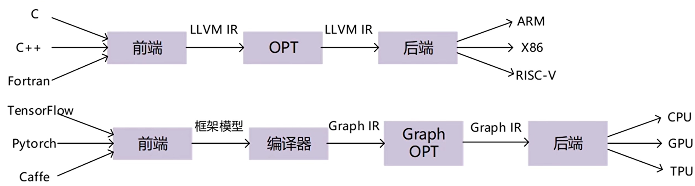

  - 将机器学习的执行从**开发形式(Development Form)**转换并优化为**部署形式(Deployment Form)**的过程

  - **开发形式** 是指我们在开发机器学习模型时使用的形式。典型的开发形式包括用 PyTorch、TensorFlow 或 JAX 等通用框架编写的模型描述，以及与之相关的权重

  - **部署形式** 是指执行机器学习应用程序所需的形式。它通常涉及机器学习模型的每个步骤的支撑代码、管理资源（例如内存）的控制器，以及与应用程序开发环境的接口（例如用于 android 应用程序的 java API）

    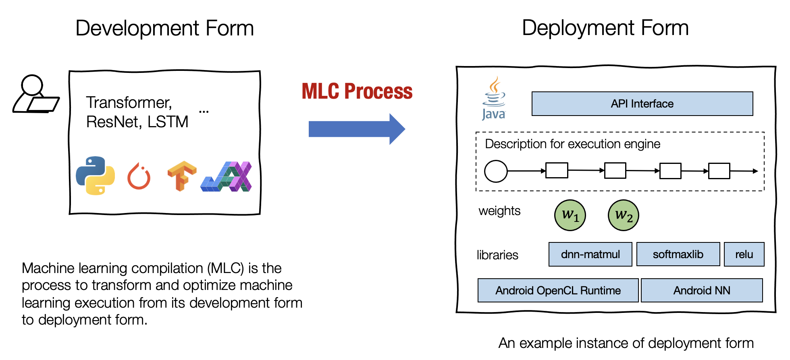

    - 将模型逐层分解：模型 -> 计算图 -> 算子 -> 循环/硬件映射 ->硬件指令
    - 根据硬件平台的不同，每一层的实现都可以灵活实现

  - 传统编译和机器学习编译的另一张对比图，便于理解：

  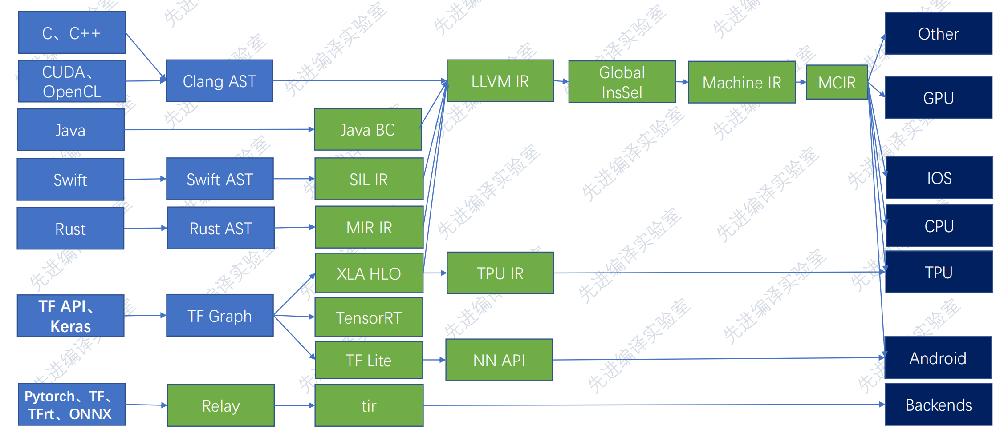

- MLC的目标：

  - **Integration and Dependency Minimization**：
    - 将必要的元素组合在一起以用于部署应用程序
    - 该能力能够减小应用的大小，并且可以使应用程序部署到的更多的环境
  - **Leverage Hardware Native Acceleration**
    - 利用硬件本身的特性进行加速
  - **Optimization in General**
    - 优化内存使用
    - 提升执行效率
    - .....

### 1.2 Why Learning MLC

- **构建机器学习部署解决方案**
  - 在将模型进行实际部署时，往往涉及很多复杂的环节
  - MLC希望提供一套解决方案，能够有效解决部署过程中遇到的**内存占用、性能优化、依赖项最小化**等问题
- **深入理解现有深度学习框架**
  - 掌握一些底层技术原理，有利我们构建与**底层技术协同优化的模型**
- **构建新兴硬件的软件栈**
  - 机器学习编译技术提供了构建软件栈的工具
  - 能够持续适应**新型硬件**加速功能与**模型演进**

### 1.3 Key elements in MLC

- **计算图（Computation Graph)**

  - **节点**：**Tensor Function**
    - 不一定对应计算的单个步骤（单个算子），部分计算甚至整个端到端计算可以看做张量函数
  
  - **边**： **Tensor**

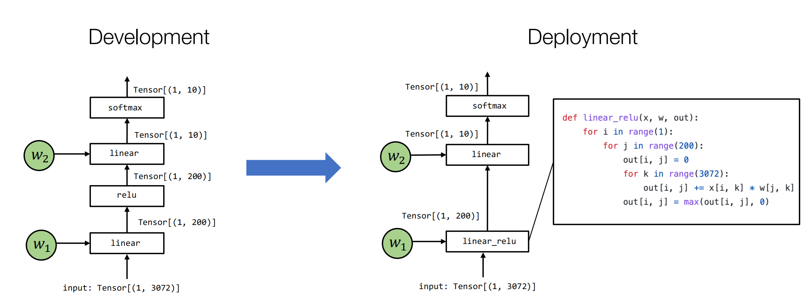

- Abstraction and Implementation:

  - **Abstraction**: 抽象是指以不同方式表示同一张量函数(tensor function)
  - **Implementation**: 张量函数的具体实现（相对而言）

  - 因此大多数MLC过程可视为**在相同或不同抽象下转换和组装张量函数的过程**

- 四个抽象层级（MLC 的 四个层级，基于TVM，但是其他深度学习编译框架也差不多）
  - Computational Graphs
  - Tensor Programs
  - Libraries and Runtimes
  - Hardware Primitives

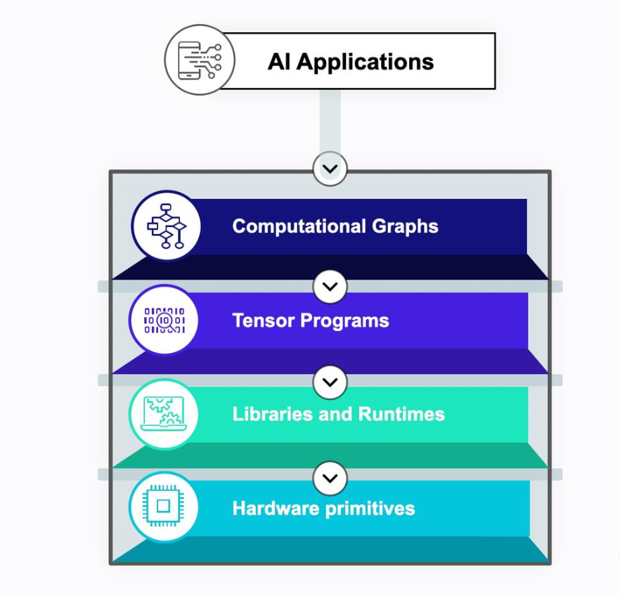


## 2. Common AI Compilers

### 2.1 TVM (Tensor Virtual Machine)

Apache TVM 是一个机器学习编译框架，**遵循Python 优先开发和通用部署的原则。** 

它接受经过预训练的机器学习模型，编译并生成可部署的模块，这些模块可以嵌入到任何地方运行。Apache TVM 还支持自定义优化过程，以引入新的优化方法、库、代码生成等等。

- **Python 优先：** 优化过程完全可以在 Python 中自定义。无需重新编译 TVM 栈即可轻松定制优化流程。
- **可组合性：** 优化过程具有可组合性。可以轻松地将新的优化过程、库以及代码生成器组合进已有的流程中

#### 2.1.1 Key Flow （Deployment）

1. **导入 / 构建一个机器学习模型**
   - TVM 支持从多种框架导入模型用于通用机器学习模型，如 PyTorch、TensorFlow。同时对于大语言模型场景，也可以使用 Relax 前端直接创建模型。
2. **通过** `pipelines`**执行可组合的优化转换**
   - pipeline 封装了一系列转换，以实现两个目标：
     - **图优化：** 如算子融合、布局重写等。
     - **张量程序优化：** 将算子映射到底层实现（包括库或代码生成器）
3. **构建并通用部署**
   - Apache TVM 旨在提供一种通用部署方案，将机器学习带到任何地方，以最少的运行时支持适配各种语言。TVM 的运行时可在非 Python 环境中运行，因此适用于移动端、边缘设备，甚至是裸机设备。

#### 2.1.2 Architecture

编译流程：

- **导入：** 前端组件将模型引入到 IRModule 中，它包含了内部表示模型的函数集合。
- **转换：** 编译器将 IRModule 转换为功能与之等效或近似等效（例如在量化的情况下）的 IRModule。许多转换与 target（后端）无关，并且允许 target 配置转换 pipeline。
- **Target 转换：** 编译器将 IRModule 转换（codegen）为指定 target 的可执行格式。target 的转换结果被封装为 runtime.Module，可以在 runtime 环境中导出、加载和执行。
- **Runtime 执行：** 用户加载 runtime.Module，并在支持的 runtime 环境中运行编译好的函数

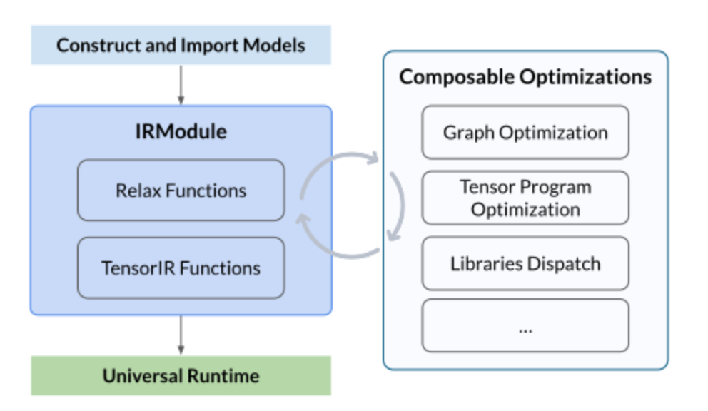

#### 2.1.3 Key Concepts

- **IRModule**:是整个堆栈中使用的主要数据结构。一个 IRModule（intermediate representation module）包含一组函数。目前支持两种主要的功能变体（variant）
  - **relay::Function** 是一种高层功能程序表示。一个 relay.Function 通常对应一个端到端的模型
  - **tir::PrimFunc** 是一种底层程序表示，包含循环嵌套选择、多维加载/存储、线程和向量/张量指令的元素。通常用于表示算子程序，这个程序在模型中执行一个（可融合的）层
  - 在编译期间，Relay 函数可降级为多个 tir::PrimFunc 函数和一个调用这些 tir::PrimFunc 函数的顶层函数
- **TensorIR**:  是 Apache TVM 栈中的核心抽象之一，用于表示和优化原始的张量函数
- **Relay (Relax)**: Relax 是 Apache TVM 栈中用于图优化和转换的高级抽象层。此外，Apache TVM 将 Relax 和 TensorIR 结合在一起，作为跨层优化的统一策略。因此，Relax 通常与 TensorIR 紧密协作，用于表示和优化整个 IRModule

#### 2.1.4 Shorts

- 虽然支持多种后端（CPU、GPU、ARM、NPU等），但对**非主流或新兴硬件**（特别是定制化AI加速器）的支持需要投入大量工程工作
- 早期 TVM 对动态形状（Dynamic Shapes）的支持较弱，但是好像后续开发的Relax在不断增加对这方面的支持。当前具体支持程度需要后续再学习调研


### 2.2 MNN/TFLite/NNAPI

三者都是移动端的**通用高效推理引擎**

- TensorFlow Lite (TFLite): 谷歌发布的高效的移动深度学习框架  (Google, 2017)。**TF-Lite 针对性能较弱的设备（如移动电话和嵌入式设备）进行了优化**
- 对于 Android 智能手机，Google 提供了自己的设备推理解决方案，即 ML-kit 和神经网络 API (NNAPI) (Google，2016)
- 这一章节主要针对**MNN**来概括：MNN是一个轻量级的深度神经网络引擎，支持深度学习的推理与训练

#### 2.2.1 MNN Features

- 轻量性
- **通用性：**
  - 支持 Tensorflow、Caffe、ONNX、Torchscripts 等主流模型文件格式，支持CNN / RNN / GAN / Transformer 等主流网络结构。
  - 支持多输入多输出，支持任意维度的输入输出，支持动态输入（输入大小可变），支持带控制流的模型
  - 算子丰富，支持 178 个Tensorflow Op、52个 Caffe Op、163个 Torchscipts Op、158 个 ONNX Op（ONNX 基本完整支持）
  - 支持 服务器 / 个人电脑 / 手机 及具有POSIX接口的嵌入式设备，支持使用设备的 CPU / GPU 计算，支持部分设备的 NPU 计算（IOS 11 + CoreML / Huawei + HIAI / Android + NNAPI）
  - 支持 Windows / iOS 8.0+ / Android 4.3+ / Linux  及具有POSIX接口的操作系统
- **高性能：**
  - 对iOS / Android / PC / Server 的CPU架构进行了适配，编写SIMD代码或手写汇编以实现核心运算，充分发挥 CPU的算力，单线程下运行常见CV模型接近设备算力峰值
  - 支持基于 Metal / OpenCL / Vulkan 使用移动端设备上的GPU进行推理
  - 支持基于 CUDA 使用 PC / Server 上的 NVIDIA GPU 实现更快速的推理
  - 广泛运用了 Winograd 卷积算法提升卷积性能，首次在业界工程实践中实现转置卷积的Winograd算法优化与矩阵乘的Strassen算法优化，并取得加速效果
  - 支持低精度计算（ int8 / fp16 / bf16）以提升推理性能。
- 易用性

MNN提出了三种核心创新（不完全展开）：

- **运行时半自动搜索架构**
  - TVM 为代表的的全自动搜索（i.e. 自动调优)
  - NCNN 为代表的全手动搜索（i.e. 手工实现每个 case）
  - **MNN 提出了一个特殊的处理过程，称为「预推理」。预推理过程中，会提前进行算子的计算策略选择和资源分配**
- **卷积算法优化创新**
- **异构设备混合调度**

#### 2.2.2 Differences between AI Compiler and Inference Engine ？

(这个问题还是基于chatgpt，个人对于推理引擎的理解还比较浅)

MNN:

- MNN也支持一些编译器做的事情：图优化、算子融合、多硬件支持
- **不支持IR分层**
- 不支持自动调度搜索（MNN提出了半自动搜索架构，但是支持的算子仍然有限）
- **不是通用 compiler infrastructure**：不能拿去支持“任意新硬件”

推理框架做的事（AI提供，不确定准确性）

```
模型文件
  ↓
解析网络结构
  ↓
构建执行图（Execution Graph）
  ↓
选择 backend（CPU / GPU / NPU）
  ↓
调度算子
  ↓
调用 kernel 执行
```

而AI Compiler:

```
模型
 ↓
Graph IR
 ↓
Tensor / Loop IR
 ↓
Codegen
 ↓
真正的高效 kernel
```

- 换句话说推理框架仍需要人提前针对硬件和模型，手写一些算子，然后再推理中直接调用
- AI Compiler根据算子描述，通过schedule和lowering，生成kernel。**kernel是结果而不是输入**

但对于我们的目标来说，“模型在端侧平台的快速部署”，是否可以选择这种推理引擎：

- MNN支持的算子也不少，应该也支持不同硬件异构实现，也许够我们用了？
- 半自动推理的自动化究竟有多高？手写算子的需求究竟如何？需要进一步探究

### 2.3 CoreML

Core ML 是苹果推出的机器学习框架，支持在 iOS、macOS、watchOS 和 tvOS 设备上本地运行机器学习模型。其核心特点包括：

- 设备端执行‌：所有计算在设备上完成，无需网络连接，保障数据隐私和实时性‌。
- 统一模型格式‌：支持神经网络、决策树、支持向量机等多种模型类型，统一转换为 .mlmodel 格式‌。
- 硬件优化‌：利用 CPU、GPU 和神经网络引擎（[Neural Engine](https://zhida.zhihu.com/search?content_id=260261833&content_type=Article&match_order=1&q=Neural+Engine&zhida_source=entity)）加速计算，降低功耗和内存占用‌

#### 2.3.1 Key Flow

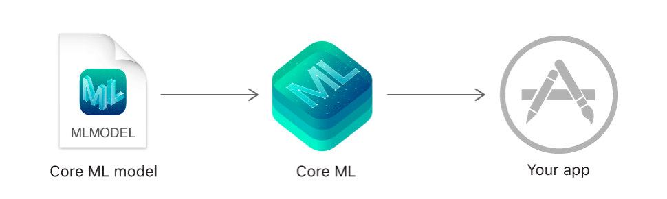

- 使用 Xcode 内置的Create ML App来构建和训练模型；或者使用 coremltools 将其他框架的模型转换为 Core ML 格式‌
- CoreML可以执行算子融合,精度转换（FP32 → FP16 / INT8）,内存布局优化等优化操作
- Core ML 会分析算子，根据支持度和性能，将任务分配到不同硬件上

#### 2.3.2 Differences with TVM

- Core ML 是**“封闭式 AI Compiler”**+与**”硬件绑定的Runtime“**
- Core ML 不支持自定义算子、改 lowering 规则、接受新硬件
- 简单来说，Core ML 是工业闭源实现，适合产品开发者

### 2.4 MLIR

准确地说MLIR并不是一种AI Compiler，而是**一整套构建 AI Compiler 的基础设施**

其开发的核心目的：**弥补框架和底层硬件之间的gap，连通上层框架和下层硬件**

MLIR提供的解决方案是：**Dialect，DialectConversion**

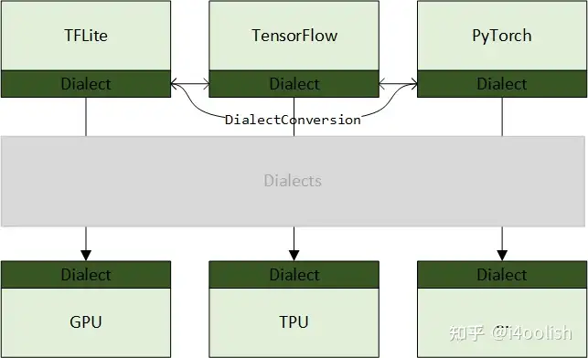

MLIR对比起来和LLVM更为相像：

- 可以理解为MLIR希望开发一种通用的IR表示，可以连接不同的框架和硬件
- 核心是Dialect，个人理解是一套**“词汇+语法规则”**；不同层级有不同的Dialect
  - 例如TVM有graph IR，TensorIR
  - MLIR可以为最上层框架设计一个Dialect A，为graph IR层设计一个Dialect B, Tensor IR设计一个Dialect C，硬件层有Dialect D;
  - 不同层Dialect之间可以进行DialectConversion(或者理解为lowering)
  - 从而实现逐层的“编译”；
  - Dialect完全是人为设计的，可以被新建，扩展和修改
- 对于我们来说，如果要使用这套框架，要先基于MLIR设计一个MLIR-based Compiler（或者找一下有没有现成的），再将其应用到具体模型部署中，似乎有点过于复杂？

### 2.5 XLA

XLA的全称是Accelerated Linear Algebra，即加速线性代数, 是一种深度学习编译器。

- XLA是**TensorFlow生态专用**的AI Compiler
- XLA更多是**图级的整体编译器**： XLA负责对Tensorflow前端定义的计算图进行优化：将图转化为 XLA 高级优化器 (XLA HLO) 表示，然后再转换成LLVM IR等更底层表示

XLA的一些概念：

- **HLO(High-Level Optimizer IR)**: XLA自己的一套IR。XLA的优化流程可以分成两方面，目标无关优化和目标相关优化。优化期间传递的就是HLO.

  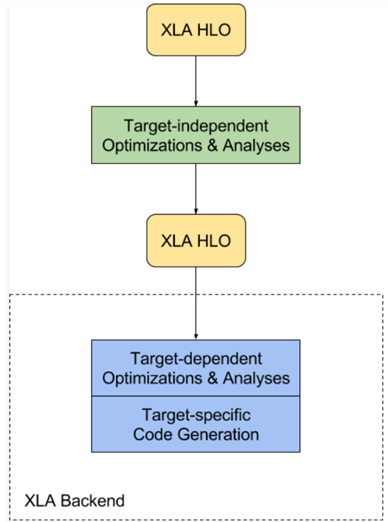

- **即时编译（JIT，Just-In-Time）**

- **超前编译（AOT，Ahead-Of-Time）**: 这两个似乎是XLA功能的主要体现，我没有深入研究

由于XLA生态绑定了TF，所以似乎并不适合我们的项目

## 3. Personal thinking

Q1: 我们的目标是什么？最终要做什么？

- 研发一个”长期平台“， 实现“**不同模型 × 不同硬件 × 快速部署”**

- 其实就是解决模型端和硬件端的**”算子不匹配问题“**

- 在已知硬件上，更换模型出现不支持的算子怎么处理？
- 相同模型部署到一个新的硬件芯片上，又该怎么处理（这个也许更复杂一些，除了算子支持问题，还要考虑端侧runtime问题）
- **“快”**或者说**“自动化”**，应该不是希望每次手写一些新算子来实现上述的部署目标。（提前写算子，或许也是条路？）


Q2：当前了解来看，TVM框架似乎是一个比较适合我们的方案

- TVM前端兼容多种深度学习框架（TensorFlow/Pytorch/...)，也支持多种Backend(LLVM/CUDA/OpenCL/Vulkan.....)
- TVM如何处理新算子
  - **Graph Partition**: 以NPU为例，TVM可以将图分为NPU子图和CPU子图（负责NPU不支持的算子），然后再runtime**调度异构执行**
  - **Schedule/autotune**: 通过写通用schedule和lowering规则，可以让TVM生成一个通用Kernel
    - 不是自己写算子
    - schedule类似于告诉系统是否tile/vectorize/parallel，TVM自动帮你写kernel（类似与LLVM中的PASS?)
    - 应该比手写算子轻松，而且主要应该还是走另外两个方式来解决
  - **BYOC(bring your own codegen)**: TVM可以使用BYOC来调用外部的库或者框架（cuDNN/TensorRT/厂商提供的SDK)

- 为啥我觉得TVM也许适合我们：移动端的NPU支持的算子各不相同，CPU总是那几个架构，TVM保证模型能通过(LLVM->CPU)这条路在端侧跑起来，性能再说？
- TVM的缺点：
  - 据说早期的TVM框架对Dynamic Shapes的支持很弱，但是最近几年社区在开发的Relax一直在迭代这方面，具体的不是很清楚
- 还有个优点：学起来比较方便，陈天奇的MLC课程基本是基于TVM的，虽然是22年的。TVM社区好像维护得也还不错


Q3：MNN/TFLite/NCNN

- 因为泽芳的调研报告里提到了MNN，以及王老师之前提到了NCNN，稍微多看了眼
- 这个在很多资料里定义为**“轻量级推理框架”**，而非AI Compiler，我的理解如下：
  - 它们确实做了一些AI编译器做的事，例如图级/内存管理的优化，对多种硬件平台和加速库的支持；
  - 我认为对于一些常规的模型和常见的硬件平台，这绝对满足我们实验室对**“端侧部署”**的要求
  - 而且性能大概率比TVM做出来的端侧版本更好
- 问题就在于其**支持的算子是有限的**（虽然官方说可扩展）
  - 以MNN为例，其支持的算子就是100多个，模型如果用了这个框架，如果有不支持的算子，不做算子拆分的话，就是直接无法运行（我的理解）
  - 其新增算子，更像是对框架内部进行改动，而不是新加一个“个人库”的感觉。更适合厂商或者框架维护的团队。
- 对于我们来说，可以用TVM做保底版本（保证模型跑起来）；用MNN来做性能对比或者性能更优版本


Q4：针对移动端部署，我有个问题，目前ncnn，高通，CoreML是如何解决的，他们使用了ai compilers吗，如果我们采用llvm的路线，可行性有多大（王老师微信问题）

- CoreML可以认为是**“苹果自研 AI Compiler”**+与**”苹果绑定的Runtime“**
- NCNN前面提到了
- 高通我的理解是芯片厂商，更多对应AI Compiler层级中的backend层级。也许会提供一套相关的SDK（提供算子库），TVM框架可以通过BYOC来接入，然后再将不支持的算子映射到CPU上（我当前的理解）
- LLVM路线：如前面所说，LLVM基本对应到CPU（好像也可以对应部分GPU），如果将整个模型都用端侧CPU来运行，我不确定能不能吃得住。但是如前面所说，以厂商NPU为主力，其他fallback到CPU，我觉得应该可以（当前理解）


Q5:我们的大目标是把多模态大模型通过ai compiler放到移动端设备上。项目的角色分配如何？

- 之前我的想法：

  - 顶层：上层模型负责人负责模型结构、Pruning、优化等
  - 中层：AI complier 负责人Operator Fusion、Quantization、Layout
  - 底层：LLVM/Kernel 负责人负责性能优化：使用LLVM进行自动优化、或手写kernel了解移动端的环境，设计时考虑和移动端的连接
  - 移动端：集成前面的编译产物，确保移动端runtime一些简单的“产品”设计、输入输出处理

- 当时的我认为，算子的优化都需要我们手动一步步来实现，包括图的优化，算子本身的优化

- 现在来看，似乎并不用，AI Compiler会帮你完成大部分的优化工作。手写算子应该是极少数的，而且移动端的芯片厂商看起来并不会希望我们自己在对应的NPU上实现算子，所以我们最多也只是通过LLVM backend在CPU上实现。那么不如直接使用前面提到TVM框架的schdule/Lowering方案

- 也许底层可以合并到中层或者移动端方面

  

## 3. Tensor Program

### 3.1 Primitive Tensor Function

- 元张量函数：最基本的张量计算单元，个人认为就是我们平时说的”算子“

  - 许多不同的抽象能够实现同样的元张量函数
  - 许多机器学习编译过程中，会将元张量函数变为**更加专门的、针对特定工作和部署环境的函数**

  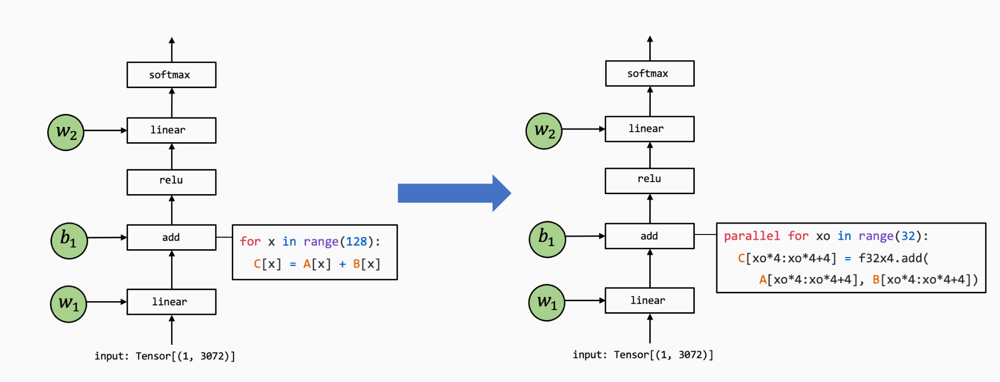

- 简单提及一些**算子内部优化**的例子

  - 将函数映射到专门的算子库
  - 上面例子里展示的并行计算实现
  - ......

### 3.2 Tensor Program Abstraction

Tensor Program 更关注于循环的优化和数据的排布

元张量函数实现的抽象往往包含以下几个部分：

- 存储数据的多维数组（Multi-dimensional buffers)
- 驱动张量计算的循环嵌套（Loop nests）
- 计算部分本身的语句（Computations)

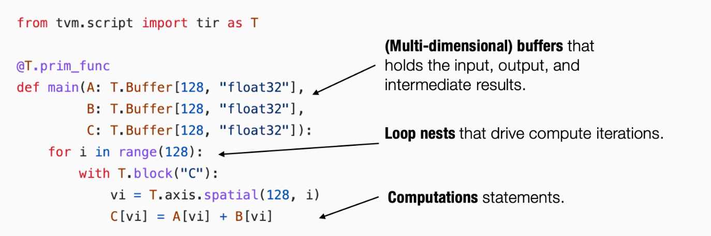

为什么要写成特定形式的张量程序？为什么不直接用C语言/Cuda去实现呢？

- 当前理解：方便实现优化的自动化
- 可以应用一些**Program-based transformation**,用于加速张量程序的执行
- 张量程序中额外的结构能够为程序变换提供更多的信息（如上图中的spatial）


## Reference

1. [模型加速与 AI compiler 介绍](https://zhuanlan.zhihu.com/p/617043119)

2. [Machine Learning Compilation 课程](https://book-zh.mlc.ai/)

3. [Apache TVM 中文文档](https://tvm.hyper.ai/docs/)

4. [Relax: TVM 的下一代图层级 IR](https://zhuanlan.zhihu.com/p/523395133)

5. [TVM，MLIR，LLVM各自有哪些缺陷？](https://zhuanlan.zhihu.com/p/1990662498647574219)

6. [CoreML 的优势与性能](https://zhuanlan.zhihu.com/p/1927420389815988747)

7. [CoreML简体中文文档](https://developer.apple.com/cn/documentation/coreml/)

8. [人工智能编译器MLIR-官方入门教程讲解](https://www.bilibili.com/video/BV1Hd4y1U7mb/?spm_id_from=333.1387.favlist.content.click&vd_source=47b9e94682446eba3bcd8ada1d947692)

9. [MNN文档](https://mnn-docs.readthedocs.io/en/latest/)

10. [AI编译器和推理引擎的区别](https://bbs.huaweicloud.com/blogs/398747)

11. [MNN: A UNIVERSAL AND EFFICIENT INFERENCE ENGINE将模型适配到各种终端硬件的解决方案，加速，量化，保精度](https://blog.csdn.net/weixin_43424450/article/details/144449776)

12. [MLIR入门理解1](https://zhuanlan.zhihu.com/p/450022851)

13. [一文带你从零认识什么是XLA](https://zhuanlan.zhihu.com/p/445994865)

    