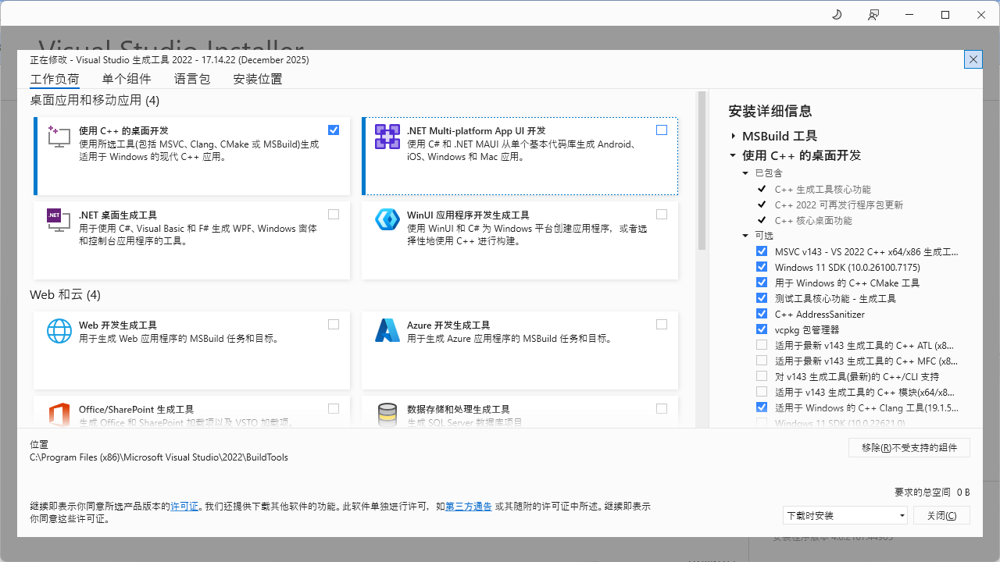

# 本地环境配置

## 安装Visual Studio 生成工具 2022

- 链接：https://visualstudio.microsoft.com/downloads/

  - 并非直接download(会下载vs 2026)
  - 在“旧版下载”中下载VS 2022

- 所需组件

  - Desktop development with C++
  - C++ CMake tools for Windows
  - C++ Clang Compiler for Windows
  - MSVC v143 Toolset
  - Windows SDK 10/11

  

- 验证方法：

  打开 **Developer Command Prompt for VS 2022**：

  ```
  clang --version
  cmake --version
  ```

  期望输出示例：

  ```
  clang version 18.x.x
  cmake version 3.22.x or above
  ```

- 添加到环境PATH：

  - 直接在cmd中输入上述cmake和clang命令，会无法得到期望输出，是因为没有添加到**系统PATH**

  - 右键 → 计算机/此电脑 → 属性 → 高级系统设置 → 环境变量，添加类似如下path:

    ```
    C:\Program Files\Microsoft Visual Studio\2022\BuildTools\Common7\IDE\CommonExtensions\Microsoft\CMake\CMake\bin
    
    C:\Program Files\Microsoft Visual Studio\2022\BuildTools\VC\Tools\Llvm\bin
    ```


## VS Code 安装

- 官网下载；链接：https://code.visualstudio.com/?wt.mc_id=vscom_downloads

### VS插件推荐

在 VS Code 左侧 **Extensions** 搜索并安装：

1. **C/C++（Microsoft）**

   - 提供 IntelliSense、调试、跳转

2. **CMake Tools**

   - 核心插件（非常重要）

3. （可选）**CMake Language Support**

   - 语法高亮

     

## 第一次创建CMake项目

1. 创建项目和相关源文件

2. 选择编译器：

   - 打开 `CMakeLists.txt`
   - 右下角会弹出：**Select a Kit** （或者Ctrl + Shift + P）

   - 选择你本机的编译器：Windows（推荐）`Visual Studio Build Tools 2022 Release - amd64`

3. Configure（生成构建文件）

   - **建议以管理员模式打开VS code，否则configure可能会出错**

   - `Ctrl + Shift + P`
   - 输入：`CMake: Configure`

   成功后你会看到：

   - 左侧多了 `build/` 目录
   - 底部状态栏显示： `CMake: Ready`（也有可能没有，看output是否正常）

4. 构建(VS Code 内完成）

   - 点击状态栏的 **Build**或 `Ctrl + Shift + P` → `CMake: Build`

5. Run

   - 在 `main.cpp` 中 点击右上角 Run

   或者：

   - `Ctrl + Shift + P`； 选择`CMake: Run Without Debugging`


## Git 本地配置

### Git安装

1. 打开：https://git-scm.com
2. 点击 **Download for Windows**
3. 安装时：
   - 一路 **Next**
   - 默认选项全部 OK
   - 遇到：
     - *“Use Git from Git Bash only”* → **保持默认**
     - *Line ending* → **Checkout Windows-style, commit Unix-style**

安装完成后：

1. 右键任意文件夹
2. 看到 **“Git Bash Here”** → 安装成功

### Git 配置

打开 **Git Bash**，依次输入：

```
git config --global user.name "你的GitHub用户名"
git config --global user.email "你的GitHub注册邮箱"
```

检查：

```
git config --global --list
```

### Problems

#### 1. 本地开启VPN/代理，推送失败问题

- 打开你的 VPN 客户端，找到 **“系统代理 / HTTP代理 / Mixed Port”**

- 找到当前使用的端口号，类似于：

  ```
  HTTP Proxy: 127.0.0.1:7890
  or
  Mixed Port: 127.0.0.1:7890
  ```

- 给Git设置代理：

  ```
  git config --global http.proxy http://127.0.0.1:7890
  git config --global https.proxy http://127.0.0.1:7890
  ```

- 然后确认：

  ```
  输入：
  git config --global --get http.proxy
  git config --global --get https.proxy
  
  输出：
  http://127.0.0.1:7890
  ```

- 此时 `git push`大概率成功